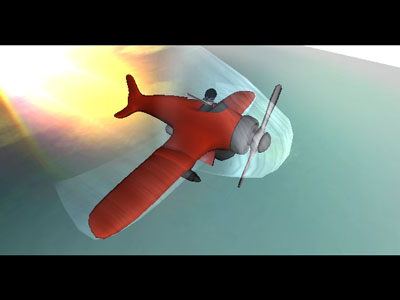

# IV - Racer

[youtube](https://www.youtube.com/watch?v=mHV_oIYZyEg)
[scene.org](https://files.scene.org/view/parties/2002/thegathering02/demo/iv_-_racer_by_tls.zip)
[pouet.net](http://www.pouet.net/prod.php?which=5555)

## Background
This is all the source code and material for the demo 'IV - Racer' made by The Lost Souls. The demo finished 2nd at The Gathering 2002 in Hamar, Norway.

## Credits
Code, graphics, 3d modeling: Cyberfish/TLS
Graphics, 3D modeling: Rawhead/TLS
Music: Kezoomer/TLS

## Compiling
TODO

## The data files
TODO